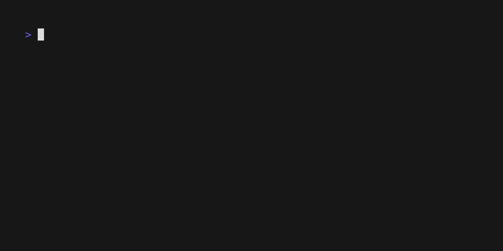

# Logger
A Custom project agnostic logger, intended for use with most of my projects. 

## Why?
This is a two-day effort to combine some of the common logging functionality I've implemented in previous project. 
I "Bit the bullet" and combined them into a single package. 

## Objective
This version is intended to create pathways to log to console messages of different severities
`INFO,` `DEBUG,` `ERROR,` `WARNING,` `INTERRUPT SIGNAL`, and `CRITICAL.`

Message logged with severities print out as time-stamped, and color-coded messages to console. 
Critical and signal interrupt messages are both called a generic exit sequence. 

## How to use
The below example starts a logger with a generic log.Default() base logger interface.

```golang
 l := logger.StartLogger(log.Default())
 _, err := foo(){}
 if err != nil {
  l.Warning(err)
 }
```

## Example



## Caveats
I want to make this more customizable in the future and work to create paths for logging to multiple sources. 
There are still more concepts I need to learn when setting up logging this way, and I need to dive deeper to implement them. 

There's also a decent chance I'm re-inventing the wheel with a lot of this, but I find a lot of personal value in recreating things that
possibly already exist, at least for my own personal projects.
